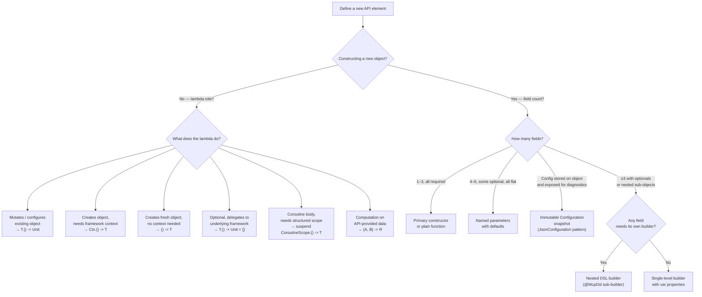
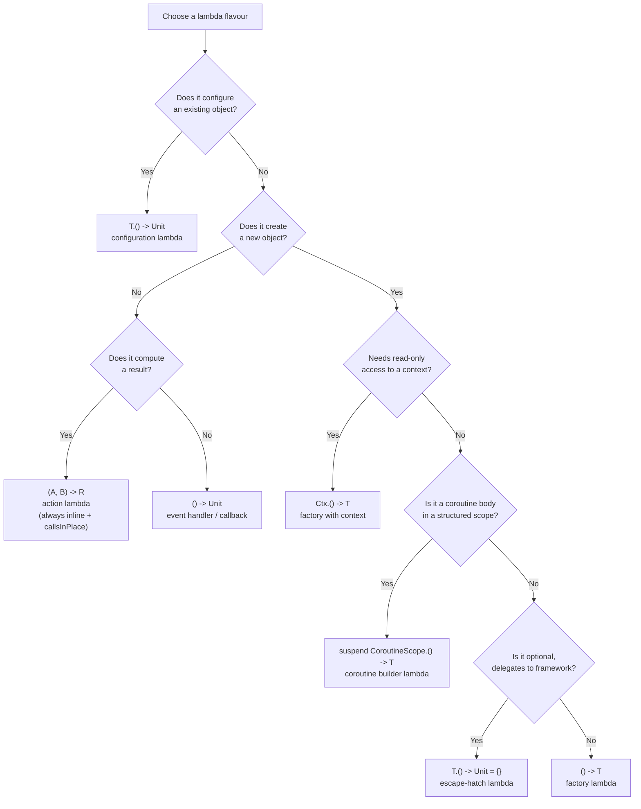
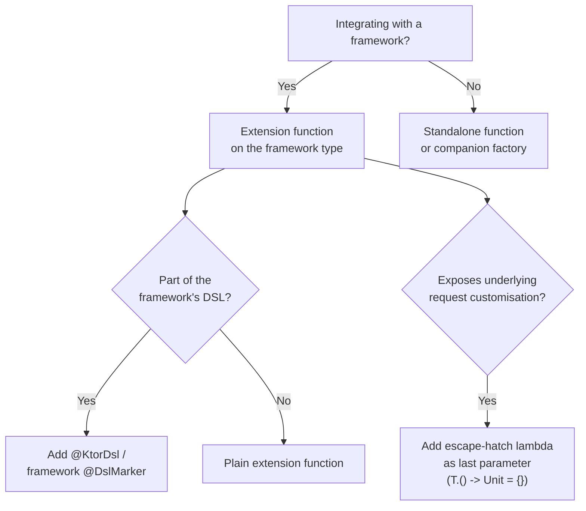

# Kotlin API Design Guidelines

**NB! 🤖 This document is AI-generated. AI can make mistakes** 

> **Purpose:** Provide _measurable_ decision criteria for choosing between DSL builders,
> lambdas with receivers, and plain method parameters.
> The [official Kotlin API guidelines](https://kotlinlang.org/docs/api-guidelines-minimizing-mental-complexity.html)
> name the patterns but do not tell you _when_ to use them. This document does.

See also: https://github.com/JetBrains/kotlin/blob/master/analysis/docs/contribution-guide/api-development.md

---

## Quick Reference

| Pattern | Parameters | Required fields | Nesting | Reuse |
|---|---|---|---|---|
| Plain parameters | ≤ 3 | All required | None | Irrelevant |
| Named arguments + defaults | 2–6 | Mix of required/optional | None | Irrelevant |
| `Configuration` snapshot | — | All optional | None | Stored on object; exposed read-only for diagnostics |
| Configuration lambda (`T.() -> Unit`) | — | — | 1 level, single concern | Not stored |
| Factory lambda (`() -> T`) | — | — | None | New object per call |
| Factory lambda with context (`Ctx.() -> T`) | — | — | 1 level | New object per call |
| Escape-hatch lambda (`T.() -> Unit = {}`) | — | — | 1 level | Optional customization |
| Coroutine builder lambda (`suspend CoroutineScope.() -> T`) | — | — | Structured concurrency scope | Bounded by parent scope |
| Action lambda (`(A, B) -> R`) | — | — | None | Synchronous computation |
| DSL builder (`build*` + `*Builder`) | — | Mix + required | ≥ 2 levels _or_ ≥ 3 fields | Object is stored |
| Extension on framework type | — | — | Framework scope | Framework-bound |
| Mutable/read-only pair (`_backing` + `val prop`) | — | — | None | Hot stream / shared state |

---

## 1. Plain Method Parameters

Use plain parameters when **all three** conditions hold:

1. **≤ 3 parameters** after removing the trailing lambda (if any)
2. **All parameters are required** or have obvious, universal defaults
3. **Parameters are primitives or well-known SDK types** (no complex nesting)

<details><summary>Reasoning</summary>

At ≤ 3 required parameters, positional calls remain readable — the reader maps each argument to its parameter without names. Beyond 3, callers start making argument-ordering errors. The Kotlin stdlib confirms the threshold: `Channel(capacity, onBufferOverflow, onUndeliveredElement)` and `MutableSharedFlow(replay, extraBufferCapacity, onBufferOverflow)` both use exactly 3 named parameters without a `Configuration` class. The "all required or obvious defaults" and "primitives or SDK types" conditions prevent ambiguity from optional parameters and complex nesting, which respectively warrant named arguments (§2) or a DSL builder (§4).

</details>

### Examples from this codebase

```kotlin
// ✅ Named parameters — 3 required + 1 optional with a sensible default; no boolean-flag noise
fun addResource(uri: String, name: String, description: String,
                mimeType: String = "text/html",
                readHandler: suspend (...) -> ...)

// ✅ One enum parameter — nothing to name or configure
fun removeTool(name: String): Boolean

// ✅ Atomic query — caller has all values, no builder needed
fun clientConnection(sessionId: String): ClientConnection
```

### Counter-examples (do NOT use plain parameters)

```kotlin
// ❌ 7 parameters — even with defaults, call sites become unreadable
fun addTool(name, description, inputSchema, title, outputSchema, toolAnnotations, meta, handler)
// → Prefer named arguments with defaults (see §2) or a builder (see §3)

// ❌ Optional nullable parameters mixed with required ones cause confusion
fun Tool(name: String, inputSchema: ToolSchema, description: String? = null,
         outputSchema: ToolSchema? = null, title: String? = null, ...)
// → A dedicated builder makes required vs optional obvious
```

---

## 2. Named Arguments with Default Values

Use named arguments when **at least one** condition holds _and_ nesting is absent:

1. **2–6 parameters** with clear, independent semantics
2. **Some parameters are optional** with reasonable defaults
3. **All parameters are "flat"** — no parameter accepts another lambda or builder

<details><summary>Reasoning</summary>

Named arguments eliminate positional ambiguity for optional parameters and make call sites self-documenting. The 2–6 range is derived from readability: at 4+ arguments, callers begin making argument-ordering mistakes; at 7+, the call site becomes a wall of values requiring the reader to count positions. The "flat" constraint is critical — once a parameter itself accepts a lambda, trailing-lambda syntax is no longer available at the call site and a DSL builder (§4) provides better readability. The `@Suppress("LongParameterList")` signal is mechanical evidence that the Kotlin IDE inspection has already fired, confirming the list has exceeded the readable threshold.

</details>

### Measurable threshold: the `@Suppress("LongParameterList")` smell

When you add `@Suppress("LongParameterList")`, that is a signal to consider a builder.
If you add it and any parameter itself takes a lambda, switch to a DSL builder immediately.

<details><summary>Reasoning</summary>

The `LongParameterList` inspection fires at 6+ parameters by default in IntelliJ/Kotlin inspections. Suppressing it with an annotation is an explicit acknowledgement that the code has exceeded readable limits. Using that suppression as a migration trigger prevents gradual drift toward unreadable constructors. The "any parameter takes a lambda" addendum is stricter: once a parameter itself is a lambda, trailing-lambda syntax is unavailable for any other trailing lambda, making the call site structurally unreadable. A DSL builder resolves this by making every property a named `var` assignment.

</details>

### Examples from this codebase

```kotlin
// ✅ Named arguments — 4 params, all flat, mix of optional
fun addPrompt(
    name: String,
    description: String? = null,
    arguments: List<PromptArgument>? = null,
    promptProvider: suspend ClientConnection.(GetPromptRequest) -> GetPromptResult,
)

// ✅ Boolean flag with default — tiny optional customization
fun roots(listChanged: Boolean? = null)

// ✅ Configuration class with defaults — all flat, no nesting
class ProtocolOptions(
    var enforceStrictCapabilities: Boolean = false,
    var timeout: Duration = DEFAULT_REQUEST_TIMEOUT,
)
```

---

## 3. Lambda with Receiver (`Type.() -> Unit`)

Use a lambda with receiver when:

1. **Configuring an existing object or scope** from outside (not constructing a new one)
2. **The block is called exactly once** (use `contract { callsInPlace(block, EXACTLY_ONCE) }`)
3. **Caller needs access to `this`** inside the block (e.g., call methods, set properties)
4. **One level of nesting** — the block itself does not take further builder lambdas

<details><summary>Reasoning</summary>

The receiver type `T` in `T.() -> Unit` provides the caller with implicit `this` — all properties and methods of `T` are directly accessible without qualification. This is the pattern used by `buildString { append("…") }`, `apply { … }`, and all Ktor plugin installers. The `callsInPlace(EXACTLY_ONCE)` contract is required so the compiler can prove the block runs, enabling `val` definite assignment, smart casts, and null-safety inference inside the block — without it, the compiler assumes the lambda may not execute at all. The single-nesting constraint prevents two receivers from being simultaneously in scope, which would cause `@DslMarker` to be required at multiple levels and confuse IDE autocomplete.

</details>

### Examples from canonical libraries

```kotlin
// ✅ Kotlin stdlib — buildString configures a StringBuilder, returns immutable String
inline fun buildString(builderAction: StringBuilder.() -> Unit): String {
    contract { callsInPlace(builderAction, InvocationKind.EXACTLY_ONCE) }
    return StringBuilder().apply(builderAction).toString()
}

// ✅ kotlinx.serialization — Json { } configures a sealed Json instance
fun Json(from: Json = Json.Default, builderAction: JsonBuilder.() -> Unit): Json

// ✅ Ktor — HttpClient { } configures the HTTP engine and plugins
val client = HttpClient(CIO) {
    install(ContentNegotiation) { json() }
    defaultRequest { url("https://api.example.com") }
}

// ✅ MCP SDK — Server configures itself in the init block
class Server(..., block: Server.() -> Unit = {}) {
    init { block(this) }
}
```

### The `@DslMarker` rule for receivers

Any class that appears as a DSL receiver **must** be annotated with `@McpDsl` (or equivalent `@DslMarker`).
This prevents implicit access to outer scopes — a subtle source of bugs in nested DSLs:

```kotlin
@DslMarker
annotation class McpDsl

@McpDsl
class CallToolRequestBuilder { ... }
```

If a class is used as a receiver but not annotated with `@DslMarker`, it allows
calling methods from an outer builder's `this` inside the inner block — a silent bug.

<details><summary>Reasoning</summary>

Without `@DslMarker`, Kotlin's implicit `this` resolution can silently dispatch a call to the _outer_ receiver when the inner receiver does not have the method. For example, inside a `BarBuilder` block nested inside a `FooBuilder` block, an unqualified `fooMethod()` call compiles successfully but modifies the outer `FooBuilder` — a completely unintended side-effect. The `@DslMarker` annotation causes the compiler to reject any unqualified call that would resolve through an outer `this`, turning the silent bug into a compile error. Real-world examples include `@HtmlTagMarker` in the Kotlin HTML DSL and `@KtorDsl` in Ktor, both of which enforce this boundary explicitly.

</details>

### `@RestrictsSuspension` for coroutine-scope builders

When a lambda with receiver is used inside a coroutine builder where only a specific
set of `suspend` functions should be callable (not arbitrary suspension), annotate the
receiver class with `@RestrictsSuspension`:

```kotlin
// ✅ Kotlin stdlib — only yield/yieldAll can be called inside sequence { }
@RestrictsSuspension
public abstract class SequenceScope<in T> internal constructor() {
    abstract suspend fun yield(value: T)
    abstract suspend fun yieldAll(iterator: Iterator<T>)
}

// Usage — calling delay() or other arbitrary suspend functions inside is a compile error
val fibs = sequence {
    yield(0); yield(1)
    // delay(100) ← compile error: restricted suspension
}
```

Use `@RestrictsSuspension` when the lambda's receiver restricts which suspend functions
are legal to call. This prevents accidental misuse of the builder scope as a general
coroutine scope.

<details><summary>Reasoning</summary>

The Kotlin stdlib's `SequenceScope` (`stdlib/src/kotlin/collections/SequenceBuilder.kt`) is annotated `@RestrictsSuspension` and its KDoc states exactly the reason: "restricted when used as receivers for extension `suspend` functions — can only invoke other member or extension `suspend` functions on this particular receiver and are restricted from calling arbitrary suspension functions." Without this annotation, a caller could write `delay(100)` inside `sequence { }`, which silently violates the lazy evaluation contract — sequences execute on a synchronous continuation that cannot suspend arbitrarily. The annotation turns that misuse into a compile-time error.

</details>

---

## 4. DSL Builder (`build*` + `Builder` class)

Use a DSL builder when **any** of the following hold:

1. **≥ 3 independently settable properties**, where at least one is optional
2. **Nested sub-builders** — a property itself requires a lambda to configure
3. **Mixed required and optional fields** that must be validated at `build()` time
4. **The constructed object is stored** (assigned to a `val` or passed to multiple callers)

<details><summary>Reasoning</summary>

The canonical model is `buildList` in the Kotlin stdlib (`stdlib/src/kotlin/collections/Collections.kt`): an `inline` top-level function with `contract { callsInPlace(builderAction, EXACTLY_ONCE) }` that applies a `MutableList.() -> Unit` lambda and returns an immutable `List`. The same pattern appears in `buildJsonObject`/`buildJsonArray` in kotlinx.serialization. The threshold "≥ 3 independently settable properties, at least one optional" reflects where named arguments stop being self-labelling: each `var name = value` assignment in a builder block is inherently self-documenting and IDE-guided, while a 7-argument named call requires the reader to scan the full list. Nested sub-builders (condition 2) make named-argument style structurally impossible — a lambda cannot be a default argument value. Stored objects (condition 4) warrant a builder because they are typically inspected after construction, which requires a stable type rather than a transient parameter list.

</details>

### Structure rules

```
buildFoo { ... }               ← inline top-level function, uses contract
    └── FooBuilder             ← annotated @McpDsl, @PublishedApi internal constructor
            ├── var requiredField: Type? = null
            ├── var optionalField: Type? = null
            ├── fun subBuilder(block: BarBuilder.() -> Unit)   ← delegates to BarBuilder
            └── @PublishedApi internal fun build(): Foo        ← validates, constructs
```

<details><summary>Reasoning</summary>

The `@PublishedApi` annotation is defined in `stdlib/src/kotlin/Annotations.kt` with this KDoc: "Public inline functions cannot use non-public API, since if they are inlined, those non-public API references would violate access restrictions at a call site. To overcome this restriction an `internal` declaration can be annotated with `@PublishedApi`." The builder constructor must be `@PublishedApi internal` (not `public`) because: (1) it prevents callers from instantiating the builder directly — they must go through the `buildFoo { }` entry point; (2) the `inline` entry function can still call it after inlining at the call site. The stdlib's own `HexFormat.Builder` (`stdlib/src/kotlin/text/HexFormat.kt`) uses exactly this pattern: `public class Builder @PublishedApi internal constructor()`.

</details>

### Examples from canonical libraries

```kotlin
// ✅ Kotlin stdlib — buildList is the canonical DSL builder pattern
inline fun <E> buildList(builderAction: MutableList<E>.() -> Unit): List<E> {
    contract { callsInPlace(builderAction, InvocationKind.EXACTLY_ONCE) }
    return mutableListOf<E>().apply(builderAction)
}

// ✅ kotlinx.serialization — buildJsonObject follows the same structure
inline fun buildJsonObject(builderAction: JsonObjectBuilder.() -> Unit): JsonObject {
    contract { callsInPlace(builderAction, InvocationKind.EXACTLY_ONCE) }
    return JsonObjectBuilder().apply(builderAction).build()
}

// ✅ MCP SDK — top-level inline entry point following the same convention
@OptIn(ExperimentalContracts::class)
@ExperimentalMcpApi
inline fun buildCallToolRequest(block: CallToolRequestBuilder.() -> Unit): CallToolRequest {
    contract { callsInPlace(block, InvocationKind.EXACTLY_ONCE) }
    return CallToolRequestBuilder().apply(block).build()
}

// ✅ Builder with required + optional fields
@McpDsl
class CallToolRequestBuilder @PublishedApi internal constructor() : RequestBuilder() {
    var name: String? = null       // required — validated in build()

    fun arguments(block: JsonObjectBuilder.() -> Unit)   // optional, sub-builder
    fun arguments(arguments: JsonObject)                  // plain overload

    @PublishedApi
    override fun build(): CallToolRequest {
        val name = requireNotNull(name) { "Missing required field 'name'..." }
        return CallToolRequest(CallToolRequestParams(name = name, ...))
    }
}
```

### Require-vs-optional convention

| Field state | How to declare | How to validate |
|---|---|---|
| Required | `var field: Type? = null` | `requireNotNull(field) { "Missing..." }` in `build()` |
| Optional with default | `var field: Type = default` | No validation needed |
| Optional nullable | `var field: Type? = null` | Pass through as `null` |

---

## 5. Dual Overloads: Value + Lambda

When a property accepts a structured value (e.g., `JsonObject`) that callers may want
to build inline, provide **both** overloads:

```kotlin
// Accept a pre-built value (interop, testing, stored references)
fun arguments(arguments: JsonObject)

// Accept a builder lambda (inline construction in DSL context)
fun arguments(block: JsonObjectBuilder.() -> Unit): Unit = arguments(buildJsonObject(block))
```

**Rule:** Provide the lambda overload only when the type itself has a well-known builder
(e.g., `buildJsonObject`, `buildList`). Do not invent builders just to add a lambda overload.

<details><summary>Reasoning</summary>

kotlinx.serialization's `JsonObjectBuilder` (`formats/json/commonMain/src/…/JsonElementBuilders.kt`) demonstrates both overloads side by side: `fun put(key: String, element: JsonElement)` accepts a pre-built value, while the extension `fun JsonObjectBuilder.putJsonObject(key: String, builderAction: JsonObjectBuilder.() -> Unit)` delegates to `put(key, buildJsonObject(builderAction))` for inline construction. The value overload is essential for testing (injecting fixtures), interop (receiving a `JsonObject` from another layer), and stored references. The lambda overload reduces boilerplate at inline DSL call sites. Providing only the lambda forces `buildJsonObject { }` even when the object already exists; providing only the value forces manual `buildJsonObject { }` at every DSL site. The "well-known builder" constraint prevents circular invention — a lambda overload is only justified when the builder already exists for other reasons.

</details>

---

## 6. Lambda Flavours

Not all lambdas with receivers serve the same purpose. Choose based on intent:

### 6.1 Configuration lambda — `T.() -> Unit`

**Use when:** The object already exists; the lambda mutates or registers things on it.
The lambda is invoked once during construction or registration and does not return a value.

<details><summary>Reasoning</summary>

The `T.() -> Unit` receiver pattern is the foundation of `buildString` (`stdlib/src/kotlin/text/StringBuilder.kt`): `StringBuilder` already exists inside the function and the lambda configures it. The caller never sees the mutable builder — only the immutable `String` result. The same applies to `apply { }` in the stdlib and all Ktor plugin installers (`install(WebSockets) { … }`). The constraint "invoked once" is enforced by `contract { callsInPlace(block, EXACTLY_ONCE) }`, which lets the compiler prove the block runs — enabling `val` definite assignment inside it.

</details>

```kotlin
// ✅ Kotlin stdlib — StringBuilder already exists, lambda configures it
val s = buildString {
    append("Hello, ")
    appendLine("World!")
}

// ✅ Ktor — HttpClient exists, lambda installs plugins and sets defaults
val client = HttpClient(CIO) {
    install(ContentNegotiation) { json() }
    defaultRequest { bearerAuth(token) }
}

// ✅ MCP SDK — Server exists, lambda registers tools/resources on `this`
val server = Server(info, options) {
    addTool("greet", "Say hello") { _ -> ... }
    addResource("file://data", "Data", "...") { _ -> ... }
}
```

### 6.2 Factory lambda — `() -> T`

**Use when:** A new instance must be created per invocation (e.g., one Server per HTTP connection).
There is no shared state; the block is a pure factory.

<details><summary>Reasoning</summary>

**Why: The reason is unknown**

The `() -> T` shape is the minimal factory signature: no receiver, no input, a new value out. Ktor uses it for `webSocket(handler: suspend DefaultWebSocketServerSession.() -> Unit)` — each incoming WebSocket connection invokes the handler independently. The key distinction from `T.() -> Unit` is that the object does not exist yet when the route is registered; the block is *stored* and called later on each connection. Using a configuration lambda (`Server.() -> Unit`) would be wrong here because there is no `Server` instance to configure at registration time.

</details>

```kotlin
// ✅ Ktor — each WebSocket connection gets a fresh handler
fun Route.webSocket(path: String, handler: suspend DefaultWebSocketServerSession.() -> Unit)

// ✅ MCP SDK — each WebSocket connection gets a fresh Server
fun Route.mcpWebSocket(block: () -> Server)
fun Application.mcpWebSocket(block: () -> Server)

// Usage
routing {
    mcpWebSocket { configureServer() }   // called once per connection
}
```

**Why not `Server.() -> Unit` here?** Because the server doesn't exist yet when the route
is registered. The block is stored and called each time a connection arrives.

### 6.3 Factory lambda with context — `Ctx.() -> T`

**Use when:** A new object must be created _and_ the factory needs read-only access to
a framework-provided context (e.g., request headers, session data).
The receiver is for _reading_, not mutating.

<details><summary>Reasoning</summary>

**Why: The reason is unknown**

This flavour combines `() -> T` (creates a new object) with a receiver (provides context). The receiver is the framework's session/request object — not something you configure, but something you read from (`call.request.header("Authorization")`). If the receiver were mutable, it would blur the boundary between "reading context" and "mutating the session", which is a correctness hazard. The `Ctx.() -> T` signature makes the intent unambiguous: `Ctx` is read-only input, `T` is the produced output.

</details>

```kotlin
// ✅ SSE — lambda receives the session to inspect headers, returns a new Server
fun Route.mcp(path: String, block: ServerSSESession.() -> Server)

// Usage — receiver used to read auth headers, not configure the session
routing {
    mcp("/sse") {
        val token = call.request.header("Authorization")
        configureServer(token)
    }
}
```

### 6.4 Action lambda — `(A, B, ...) -> R`

**Use when:** The lambda is not a configuration block but a computation called by the API.
It performs work on data provided by the caller and reports a result back.

```kotlin
// ✅ kotlinx-io: readFromHead delegates reading to the caller's lambda,
//    which returns the number of bytes it consumed
inline fun readFromHead(
    buffer: Buffer,
    readAction: (bytes: ByteArray, startIndexInclusive: Int, endIndexExclusive: Int) -> Int
): Int {
    contract { callsInPlace(readAction, EXACTLY_ONCE) }
    ...
}
```

Action lambdas are always `inline` with `callsInPlace(EXACTLY_ONCE)` when called exactly once.
They look like callbacks but they run synchronously and return a meaningful value.

<details><summary>Reasoning</summary>

kotlinx-io's `UnsafeBufferOperations.readFromHead` (`core/common/src/unsafe/UnsafeBufferOperations.kt`) is the canonical example: the library provides a `ByteArray` slice to the caller's lambda, which returns the number of bytes consumed. The lambda is `inline` and `callsInPlace(EXACTLY_ONCE)` — this means: (1) no lambda object is allocated (critical for hot I/O paths); (2) the compiler knows the lambda runs exactly once, so `val` variables assigned inside it are definitively initialised afterward. Without `inline`, a closure allocation would occur on every call — unacceptable for a zero-copy buffer API. The `(A, B) -> R` shape (no receiver, explicit inputs, meaningful return) signals to readers that this is a computation, not a configuration block.

</details>

### 6.5 Coroutine builder lambda — `suspend CoroutineScope.() -> T`

**Use when:** The lambda is a coroutine body that executes within a structured concurrency
scope. The receiver is the `CoroutineScope` so that child coroutines can be launched
and will be bounded by the parent scope's lifetime.

```kotlin
// ✅ kotlinx.coroutines — launch/async take a suspend lambda with CoroutineScope receiver
fun CoroutineScope.launch(
    context: CoroutineContext = EmptyCoroutineContext,
    start: CoroutineStart = CoroutineStart.DEFAULT,
    block: suspend CoroutineScope.() -> Unit  // ← coroutine builder lambda
): Job

// ✅ coroutineScope / supervisorScope — create a new scope, wait for all children
suspend fun <R> coroutineScope(block: suspend CoroutineScope.() -> R): R {
    contract { callsInPlace(block, InvocationKind.EXACTLY_ONCE) }
    ...
}
```

**Key properties:**
- Always `suspend` — can only be called from a coroutine or another suspend function
- Receiver is `CoroutineScope` — child coroutines launched inside are bounded by this scope
- Annotated with `contract { callsInPlace(block, EXACTLY_ONCE) }` when the block runs exactly once
- Distinct from `() -> T` (which is not `suspend` and does not provide a coroutine scope)

<details><summary>Reasoning</summary>

`kotlinx.coroutines`' `launch` and `async` (`Builders.common.kt`) take `suspend CoroutineScope.() -> Unit/T`. The `CoroutineScope` receiver is what makes structured concurrency work: any coroutine launched inside the block with `launch { }` or `async { }` becomes a child of the outer scope's `Job`, so cancellation propagates automatically and the parent waits for all children before completing. Without the `CoroutineScope` receiver, child coroutines would have no parent job and would escape the structured hierarchy. `coroutineScope { }` and `supervisorScope { }` use `contract { callsInPlace(block, EXACTLY_ONCE) }` so the compiler can perform definite assignment analysis across the suspension boundary.

</details>

| Flavour | Receiver purpose | Suspend? | Returns |
|---|---|---|---|
| `T.() -> Unit` | Mutate / register on existing `T` | No | `Unit` |
| `() -> T` | Create a new `T` from scratch | No | new `T` |
| `Ctx.() -> T` | Read context `Ctx`, create a new `T` | No | new `T` |
| `(A, B) -> R` | Compute a result using inputs from the API | No | computed value |
| `suspend CoroutineScope.() -> T` | Run coroutine body in a bounded scope | Yes | `T` |

---

## 7. `Configuration` Data Class

Canonical Kotlin libraries distinguish three separate patterns for optional parameters. The choice
is **not** driven by count — it depends on whether the configuration needs to survive past the
constructor call.

### Three patterns and when to use each

| Pattern | Use when | Canonical examples |
|---|---|---|
| **Named parameters** | Options consumed at construction; not stored or exposed afterward | `MutableSharedFlow`, `Channel` |
| **Immutable `FooConfiguration` snapshot** | Config is stored on the object and exposed read-only for diagnostics/inspection | `JsonConfiguration`, `CborConfiguration` |
| **Mutable DSL builder class** | Config is expressed inside a plugin `install { }` block, used in-place then discarded | Ktor `WebSocketOptions` |

<details><summary>Reasoning</summary>

`MutableSharedFlow(replay, extraBufferCapacity, onBufferOverflow)` uses named parameters because the options drive internal buffer setup and are never exposed publicly — there is nothing to inspect after construction. `Json` uses `JsonConfiguration` (stored as `val configuration: JsonConfiguration` on the sealed class) because callers legitimately inspect `json.configuration.encodeDefaults` after construction, for example inside custom serializers via `JsonDecoder` and `JsonEncoder`. Ktor's `WebSocketOptions` uses a mutable builder class because it is only meaningful inside the `install(WebSockets) { … }` block and is discarded after the plugin is configured — storing it would waste memory and expose a mutable object after its window of use.

</details>

### When to prefer `Configuration` over named arguments

| Named parameters | Immutable `FooConfiguration` snapshot |
|---|---|
| Options consumed at construction only | Config **stored** on the created object (`val configuration: JsonConfiguration`) |
| Options not accessible after creation | Config exposed read-only for logging, comparison, or diagnostics |
| Options don't form an inspectable unit | Options form one cohesive, inspectable snapshot |

The parameter **count is not the trigger**. `MutableSharedFlow` has 3 named parameters and no
`Configuration` class; `JsonConfiguration` has 17 properties and is stored on `Json` because
callers may inspect `json.configuration.encodeDefaults` after construction.

<details><summary>Reasoning</summary>

`JsonConfiguration` (`formats/json/commonMain/src/…/JsonConfiguration.kt`) has 17 `val` properties and an `internal constructor` — it cannot be instantiated externally. It is stored on `sealed class Json(val configuration: JsonConfiguration, …)` and its KDoc states: "Can be used for debug purposes and for custom Json-specific serializers via `JsonEncoder` and `JsonDecoder`." This is the concrete evidence that inspectability after construction — not count — is the deciding factor. Counting parameters and picking a pattern based on that number alone would have given the wrong answer here.

</details>

### Named parameters — `MutableSharedFlow` (kotlinx.coroutines)

```kotlin
// 3 named params with defaults — no Configuration class.
// Options drive internal buffer setup and are NOT stored publicly.
@Suppress("FunctionName")
public fun <T> MutableSharedFlow(
    replay: Int = 0,
    extraBufferCapacity: Int = 0,
    onBufferOverflow: BufferOverflow = BufferOverflow.SUSPEND,
): MutableSharedFlow<T> = ...

// Channel follows the same pattern
public fun <E> Channel(
    capacity: Int = Channel.RENDEZVOUS,
    onBufferOverflow: BufferOverflow = BufferOverflow.SUSPEND,
    onUndeliveredElement: ((E) -> Unit)? = null,
): Channel<E> = ...
```

### Immutable snapshot — `JsonConfiguration` (kotlinx.serialization)

```kotlin
// 17 val properties — internal constructor prevents external instantiation.
// Stored on the format object: sealed class Json(val configuration: JsonConfiguration, ...)
public class JsonConfiguration internal constructor(
    public val encodeDefaults: Boolean = false,
    public val ignoreUnknownKeys: Boolean = false,
    public val isLenient: Boolean = false,
    // ... 14 more val properties ...
) {
    override fun toString(): String = "JsonConfiguration(...)"  // for diagnostics
}

// Paired with a mutable builder used only inside the DSL block
public class JsonBuilder internal constructor(json: Json) {
    public var encodeDefaults: Boolean = json.configuration.encodeDefaults
    public var ignoreUnknownKeys: Boolean = json.configuration.ignoreUnknownKeys
    // ...
    internal fun build(): JsonConfiguration = JsonConfiguration(encodeDefaults, ...)
}

// Usage
val json = Json { ignoreUnknownKeys = true }
val cfg: JsonConfiguration = json.configuration  // inspectable after construction
```

### Mutable DSL builder — `WebSocketOptions` (Ktor)

```kotlin
// var properties — builder used in-place, NOT stored on the plugin object afterward.
@KtorDsl
public class WebSocketOptions {
    public var pingPeriodMillis: Long = PINGER_DISABLED
    public var timeoutMillis: Long = 15_000L
    public var maxFrameSize: Long = Long.MAX_VALUE
    public var masking: Boolean = false
    public var contentConverter: WebsocketContentConverter? = null
}

// The install block mutates the builder directly; it is not retained afterward.
install(WebSockets) {
    pingPeriodMillis = 5_000L
    timeoutMillis = 30_000L
}
```

### Migration path: deprecating flat parameters

When flat parameters are outgrown, deprecate the old constructor with `@Deprecated` and a
`replaceWith`:

```kotlin
@Deprecated(
    "Use constructor with Configuration",
    // ReplaceWith requires real parameter names to be IDE-applicable; fill them in:
    replaceWith = ReplaceWith(
        "MyClass(MyClass.Configuration(optionA = optionA, optionB = optionB))"
    ),
)
constructor(optionA: Boolean = false, optionB: String = "")
    : this(Configuration(optionA, optionB))
```

This gives callers a migration path without breaking existing code.

<details><summary>Reasoning</summary>

`JsonConfiguration` itself demonstrates the consequence of not providing a migration path: its `classDiscriminatorMode` property carries `@set:Deprecated(…, level = DeprecationLevel.ERROR)` with the message "JsonConfiguration is not meant to be mutable, and will be made read-only in a future release. The `Json(from = …) {}` copy builder should be used instead." Without a `@Deprecated` + `replaceWith`, callers have no IDE-guided migration and both the old and new APIs silently coexist — creating confusion about which is canonical. The `ReplaceWith` expression must contain real parameter names to be IDE-applicable (the IDE can auto-apply it).

</details>

---

## 8. Extension Functions on Framework Types

When integrating with an existing framework (Ktor, coroutines, etc.), prefer extension functions
over companion objects, standalone functions, or wrapper classes.

### When to write an extension function

- You need to operate _within_ a framework scope (`Route`, `Application`, `HttpClient`)
- The framework type provides mandatory runtime context (routing tree, HTTP engine, etc.)
- Installation of framework plugins is part of the operation

<details><summary>Reasoning</summary>

**Why: The reason is unknown**

Extension functions on framework types encode the dependency on the framework at the type level: the function cannot be called unless the caller already has a `Route`, `Application`, or `HttpClient` in scope. This prevents the API from being misused outside the correct lifecycle. A standalone `fun mcpSseTransport(client: HttpClient, …)` would work, but it does not prevent being called with an unconfigured client or outside a Ktor application context. Extension functions also participate in the framework's DSL scope resolution, enabling `@KtorDsl` to prevent calls outside the routing DSL.

</details>

```kotlin
// ✅ HttpClient extensions — client is required infrastructure, not optional
fun HttpClient.mcpSseTransport(urlString: String? = null, ...): SseClientTransport
fun HttpClient.mcpStreamableHttpTransport(urlString: String, ...): StreamableHttpClientTransport
suspend fun HttpClient.mcpSse(urlString: String? = null, ...): Client      // factory shortcut
suspend fun HttpClient.mcpStreamableHttp(urlString: String, ...): Client

// ✅ Ktor server routing extensions
fun Route.mcp(path: String, block: ServerSSESession.() -> Server)
fun Application.mcp(block: ServerSSESession.() -> Server)         // installs SSE automatically
fun Application.mcpStreamableHttp(path: String, ..., block: RoutingContext.() -> Server)
```

### `@KtorDsl` (and framework-specific DSL markers)

When writing extension functions that are part of a framework's DSL, annotate them with the
framework's own DSL marker, not just your own:

```kotlin
@KtorDsl                               // Ktor's marker — prevents use outside Ktor DSL context
public fun Route.mcp(path: String, block: ServerSSESession.() -> Server)
```

Use `@KtorDsl` (or equivalent) when the function is _only_ meaningful inside a specific framework
DSL block. This prevents callers from accidentally calling it at the top level.

<details><summary>Reasoning</summary>

`@KtorDsl` is Ktor's own `@DslMarker` annotation. When applied to an extension function on `Route` or `Application`, the Kotlin compiler enforces that it can only be called from within the corresponding Ktor DSL receiver scope. Without it, an IDE provides no warning when `mcp("/sse") { }` is called at the top level of a file or inside an unrelated class — resulting in a runtime error because the routing tree is not being built. The same principle applies to any framework DSL marker: `@HtmlTagMarker`, `@KtorDsl`, `@McpDsl` — they all leverage `@DslMarker` to restrict call sites to the intended scope.

</details>

### The escape-hatch lambda (`requestBuilder: HttpRequestBuilder.() -> Unit = {}`)

When wrapping a framework type, expose an optional lambda that lets callers customise the
underlying framework object without your API enumerating every option:

```kotlin
// ✅ Three Ktor transports all follow the same pattern:
fun HttpClient.mcpSseTransport(
    urlString: String? = null,
    reconnectionTime: Duration? = null,
    requestBuilder: HttpRequestBuilder.() -> Unit = {},   // ← escape hatch
): SseClientTransport

fun HttpClient.mcpStreamableHttpTransport(
    url: String,
    reconnectionTime: Duration? = null,
    requestBuilder: HttpRequestBuilder.() -> Unit = {},   // ← escape hatch
): StreamableHttpClientTransport
```

**Rules for the escape-hatch lambda:**

1. Always provide an empty default (`= {}`): it is opt-in, never forced on the caller.
2. Name it consistently (`requestBuilder`, `block`, `configure`) across related APIs in the same module.
3. Its type is the framework's own builder type — do not wrap it in your own abstraction.
4. Place it as the last parameter so callers can use trailing-lambda syntax when they need it.

The escape-hatch avoids the "add a new parameter for every header" treadmill while keeping the
primary parameters clean and explicit.

<details><summary>Reasoning</summary>

**Why: The reason is unknown**

Without an escape hatch, every new HTTP header or request option that a caller needs forces a new parameter on the transport function — an unbounded treadmill. The empty-default rule (`= {}`) keeps the escape hatch completely invisible to callers who do not need it: the function's primary parameters stay clean. Placing it last enables trailing-lambda syntax (`mcpSseTransport(url) { bearerAuth(token) }`), which reads naturally. Using the framework's own builder type (`HttpRequestBuilder`) avoids forcing callers to learn an intermediate abstraction — they already know the Ktor DSL.

</details>

### Where to place extension functions and how to name files

Extension functions in the Kotlin ecosystem follow predictable file-placement conventions. The
driving question is: **whose vocabulary do these extensions belong to?**

#### Co-locate with your own type (same file)

If extensions are few and tightly coupled to a class you own, place them in the same file:

```
io/modelcontextprotocol/kotlin/sdk/client/
    McpClient.kt        // class McpClient + its direct extensions
```

#### Separate file named after the receiver type

When extensions on a third-party type grow beyond a handful, extract them into a dedicated file.
Name it `<ReceiverType>Extensions.kt` (or a descriptive verb noun when a clear theme exists):

```
// stdlib pattern — one file per extended type/concept
Collections.kt          // extensions on Collection, List, Map, …
Strings.kt              // extensions on String, Char, CharSequence
Sequences.kt            // extensions on Sequence<T>

// coroutines pattern — action-oriented when the theme is a behaviour
Builders.common.kt      // launch, async, withContext, …
Delay.kt                // delay, withTimeout, …
Flow.kt                 // Flow interface + core operators
```

Apply the same logic in your own modules:

```
// ✅ Good — theme is the receiver type or a clear action
HttpClientExtensions.kt     // extensions on HttpClient
RouteExtensions.kt          // extensions on Route / Application
FlowExtensions.kt           // Flow operators for your domain

// ❌ Avoid — name reveals nothing about the receiver or intent
Utils.kt
Helpers.kt
Misc.kt
```

#### Package placement rules

| Scenario | Package for the extension file |
|---|---|
| Extension adds to your own public API | Same package as the extended type |
| Extension bridges two libraries you own | Package of the _calling_ library |
| Extension is purely internal | `internal` sub-package, e.g. `…sdk.internal` |

```kotlin
// ✅ Extending HttpClient — file lives in the client module's package
// File: kotlin-sdk-client/…/client/HttpClientExtensions.kt
package io.modelcontextprotocol.kotlin.sdk.client

fun HttpClient.mcpSseTransport(...): SseClientTransport = ...
```

#### `@file:JvmName` on JVM

When a file contains only extension functions (no classes), the compiler generates a class named
`<FileName>Kt` by default. Provide a cleaner JVM name for Java callers:

```kotlin
// File: FlowExtensions.kt
@file:JvmName("McpFlows")  // Java sees McpFlows.collectMessages(flow, ...)

package io.modelcontextprotocol.kotlin.sdk

fun Flow<JsonRpcMessage>.collectMessages(...) { ... }
```

#### Summary checklist

- One concept / receiver type → one file.
- File name = `<ReceiverType>Extensions.kt` or descriptive action noun (`Builders.kt`, `Operators.kt`).
- Place in the package of the module that _owns_ the integration.
- Add `@file:JvmName` when the file contains only top-level functions and Java interop matters.

<details><summary>Reasoning</summary>

The Kotlin stdlib organises extensions by receiver type: `Collections.kt` for `Collection`/`List`/`Map` extensions, `Strings.kt` for `String`/`CharSequence`, `Sequences.kt` for `Sequence<T>`. kotlinx.coroutines uses action-oriented names when the theme is a behaviour: `Builders.common.kt` (with `@file:JvmName("BuildersKt")`) for `launch`/`async`/`withContext`, `Delay.kt` for `delay`/`withTimeout`. The `@file:JvmName` annotation on `Builders.common.kt` gives Java callers a predictable class name (`BuildersKt`) instead of the compiler-generated `Builders_commonKt`. Files named `Utils.kt` or `Helpers.kt` fail this convention — they reveal nothing about the receiver type or theme, making discovery impossible without an IDE search.

</details>

---

## 9. Naming Factory Functions

The name of a factory function signals its relationship to the type it creates.

### `build*` prefix — for protocol/message objects

Use `build*` when the factory creates a **data/message object** from a builder.
The prefix makes it clear the function runs a builder, not a constructor.

<details><summary>Reasoning</summary>

kotlinx.serialization uses `buildJsonObject` and `buildJsonArray` (`formats/json/commonMain/src/…/JsonElementBuilders.kt`) as the entry points to their respective builders. The `build*` prefix signals three things simultaneously: (1) a `Builder` class is involved internally; (2) the result is a freshly constructed value, not a singleton; (3) the function is the primary intended call site — callers should not instantiate `JsonObjectBuilder` directly. This distinguishes `buildJsonObject { }` (one-shot construction) from `Json { }` (heavyweight singleton), which would be confusing if both used the same `build*` prefix.

</details>

```kotlin
// ✅ Protocol message types — callers build many of these
fun buildCallToolRequest(block: CallToolRequestBuilder.() -> Unit): CallToolRequest
fun buildCreateMessageRequest(block: CreateMessageRequestBuilder.() -> Unit): CreateMessageRequest
```

### Type-named factory — for format/service singletons

When the result is a **heavyweight singleton** (a format, a client, a service) with
a large, optional configuration surface, name the factory after the type itself.
This reads as a pseudo-constructor.

```kotlin
// ✅ kotlinx.serialization — Json is a sealed class, `Json { }` is its factory
fun Json(from: Json = Json.Default, builderAction: JsonBuilder.() -> Unit): Json

// Callers read naturally:
val json = Json { ignoreUnknownKeys = true }
val debug = Json(json) { prettyPrint = true }  // ← copy builder with "from"
```

**Rules:**
- The type must be `sealed` or `abstract` so callers cannot instantiate it directly.
- The companion can serve as the default instance (`Json.Default`).
- Add an optional `from: T = T.Default` first parameter for the **copy builder** pattern.

<details><summary>Reasoning</summary>

`Json` in kotlinx.serialization (`formats/json/commonMain/src/…/Json.kt`) is a `sealed class` with a `fun Json(from: Json = Json.Default, builderAction: JsonBuilder.() -> Unit): Json` factory. The `sealed` constraint is load-bearing: it prevents external subclassing, which would break the library's internal dispatch. The type-named factory reads as a pseudo-constructor — `val json = Json { ignoreUnknownKeys = true }` is idiomatic and immediately legible even to newcomers. `CoroutineScope(context)` and `MainScope()` in kotlinx.coroutines follow the same pattern: factory functions named after the interface they return, with `@Suppress("FunctionName")` to silence the lint warning.

</details>

### Copy builder pattern — `fun Type(from: Type = Type.Default, block: TypeBuilder.() -> Unit)`

When an existing instance should be the baseline for a new one with overrides:

```kotlin
// ✅ kotlinx.serialization copy builder
val defaultJson = Json { encodeDefaults = true }
val debugJson = Json(defaultJson) { prettyPrint = true }   // inherits encodeDefaults

// In MCP SDK — extend existing config without repeating every field
val strictJson = Json(McpJson) { explicitNulls = true }
```

The `from` parameter seeds all builder properties from the given instance, so only
the changed fields need to be specified. This is more maintainable than re-specifying
everything when one option changes.

<details><summary>Reasoning</summary>

`Json.kt` documents this pattern explicitly in its KDoc: "Json format configuration can be refined using the corresponding constructor: `val debugEndpointJson = Json(defaultJson) { prettyPrint = true }` — will inherit the properties of defaultJson." `JsonBuilder` is initialised from the given `Json` instance: `var encodeDefaults = json.configuration.encodeDefaults`, and so on for all 17 properties. Without the copy builder, every derived configuration must repeat every field — a maintenance hazard when the base configuration changes. The `from = Default` parameter makes the pattern opt-in: callers who do not need inheritance simply omit it.

</details>

### `@Suppress("FunctionName")` for type-named factories

When a factory function is named after the type it creates (pseudo-constructor style),
Kotlin's lint raises a `FunctionName` warning because the name starts with an uppercase letter.
Suppress it explicitly so the intent is clear:

```kotlin
// ✅ kotlinx.coroutines — factory function named after the interface
@Suppress("FunctionName")
public fun CoroutineScope(context: CoroutineContext): CoroutineScope = ContextScope(...)

@Suppress("FunctionName")
public fun MainScope(): CoroutineScope = ContextScope(SupervisorJob() + Dispatchers.Main)

@Suppress("FunctionName")
public fun <T> MutableStateFlow(value: T): MutableStateFlow<T> = StateFlowImpl(value)
```

**Rule:** Every top-level factory function whose name starts with an uppercase letter
**must** have `@Suppress("FunctionName")`. Without it, Kotlin's IDE and linters report
a spurious warning that signals incorrect style.

<details><summary>Reasoning</summary>

`CoroutineScope.kt` in kotlinx.coroutines has `@Suppress("FunctionName")` on `fun MainScope()` and `fun CoroutineScope(context)` at lines 121 and 297 respectively. `StateFlow.kt` has it on `fun MutableStateFlow(value)`. The Kotlin `FunctionName` inspection requires function names to start with a lowercase letter — an intentional convention for regular functions. Type-named factories deliberately violate this convention to read as pseudo-constructors. `@Suppress("FunctionName")` is the correct signal that the uppercase name is intentional, not a mistake. Without it, CI lint tools and IDE inspections produce false positives at every occurrence, training reviewers to ignore real issues.

</details>

### `Configuration` snapshot vs mutable `Builder`

For heavyweight configured types, split into two classes:

| Class | Constructor | Mutability | Purpose |
|---|---|---|---|
| `FooBuilder` | `internal` | mutable `var` | Used during configuration block |
| `FooConfiguration` | `internal` | immutable `val` | Stored on, and exposed by, the created instance |

```kotlin
// ✅ Pattern from kotlinx.serialization
class JsonBuilder internal constructor(json: Json) {
    var encodeDefaults: Boolean = json.configuration.encodeDefaults
    // ...
    internal fun build(): JsonConfiguration = JsonConfiguration(encodeDefaults, ...)
}

sealed class Json(val configuration: JsonConfiguration, ...) {
    // configuration is read-only snapshot — callers cannot mutate it
}
```

This means `configuration` on the live instance is always a stable, immutable snapshot.
It can safely be shared across threads and used for diagnostics.

<details><summary>Reasoning</summary>

`JsonConfiguration` has `internal constructor` — external code cannot create or modify it. `JsonBuilder` has `var` properties that mirror it, and `internal fun build(): JsonConfiguration` that produces the immutable snapshot. `Json` stores the result as `val configuration: JsonConfiguration`. This split is the reason custom serializers can safely read `json.configuration.encodeDefaults` from any thread without synchronization — the `val` fields of `JsonConfiguration` are final on the JVM. If configuration were stored as a mutable `JsonBuilder`, it could be modified after construction, breaking thread-safety and diagnostics.

</details>

---

## 10. Constructor vs. Builder vs. Plain Function

| Scenario | Recommended form |
|---|---|
| Data class with all-required fields | Primary constructor |
| Data class with many optional fields | Named parameters + defaults |
| 5+ optional options forming one concept | `Configuration` data class |
| Protocol/message object built frequently | `build*` DSL builder |
| Heavyweight singleton (format, service) | Type-named factory `fun Type(block)` |
| Derivative of existing instance | Copy builder `fun Type(from = Default, block)` |
| Framework integration | Extension function on framework type |
| One-shot factory for internal use | Plain `fun create*(...)` |
| Common result shapes | Companion object factory |

<details><summary>Reasoning</summary>

**Why: The reason is unknown**

This table consolidates all the individual rules from §1–§9 into a single decision matrix. The choices are not arbitrary — each row corresponds to a principle established in earlier sections and demonstrated by canonical library examples. The primary constructor is the simplest form (data class with all-required fields); each step down the table adds complexity only when the simpler form cannot express the design. Choosing a more complex form when a simpler one suffices is over-engineering; choosing a simpler form when complexity is warranted produces unreadable call sites.

</details>

```kotlin
// Companion factory — for common result shapes, not full construction
fun CallToolResult.Companion.success(content: String, meta: JsonObject? = null): CallToolResult
fun CallToolResult.Companion.error(content: String, meta: JsonObject? = null): CallToolResult
```

---

## 11. `@PublishedApi internal` vs `internal` Constructor

Both hide the builder constructor from public use, but the choice depends on whether the factory is `inline`:

| Factory is `inline` | Constructor visibility |
|---|---|
| Yes (most DSL builders) | `@PublishedApi internal constructor` — the `inline` function must access internal members after inlining |
| No (heavyweight factories like `Json { }`) | Plain `internal constructor` — no inlining occurs, `@PublishedApi` is unnecessary |

<details><summary>Reasoning</summary>

The stdlib's `@PublishedApi` KDoc (`stdlib/src/kotlin/Annotations.kt`) states the exact rule: "Public inline functions cannot use non-public API, since if they are inlined, those non-public API references would violate access restrictions at a call site." When `buildFoo { }` is `inline`, the compiler copies its body — including the `FooBuilder()` constructor call — into the caller's module. If the constructor is plain `internal`, the caller's module cannot access it after inlining, causing a compilation error. `@PublishedApi` makes `internal` declarations accessible at inline call sites while keeping them hidden from non-inline usage. `JsonBuilder` uses plain `internal constructor` because `fun Json(…)` is not `inline` — no inlining occurs, so `@PublishedApi` is unnecessary overhead.

</details>

```kotlin
// ✅ inline factory → @PublishedApi internal constructor
inline fun buildCallToolRequest(block: CallToolRequestBuilder.() -> Unit): CallToolRequest {
    contract { callsInPlace(block, InvocationKind.EXACTLY_ONCE) }
    return CallToolRequestBuilder().apply(block).build()   // needs @PublishedApi
}
class CallToolRequestBuilder @PublishedApi internal constructor()

// ✅ non-inline factory (Json-style) → plain internal constructor
fun Json(from: Json = Json.Default, builderAction: JsonBuilder.() -> Unit): Json {
    val builder = JsonBuilder(from)
    builder.builderAction()                                // no inlining — plain internal is fine
    return JsonImpl(builder.build(), builder.serializersModule)
}
class JsonBuilder internal constructor(json: Json)
```

---

## 13. `inline` and Kotlin Contracts

Every **top-level DSL entry function** should be `inline` with a contract:

```kotlin
@OptIn(ExperimentalContracts::class)
inline fun buildFoo(block: FooBuilder.() -> Unit): Foo {
    contract { callsInPlace(block, InvocationKind.EXACTLY_ONCE) }
    return FooBuilder().apply(block).build()
}
```

**Why `inline`:** Avoids lambda object allocation. Also required so that `@PublishedApi internal`
members of the builder (constructor, `build()`) are accessible at the call site after inlining.

**Why `contract`:** Lets the compiler know the lambda runs exactly once, enabling:
- Definite assignment of `val` variables inside the block
- Smart casts that survive the block
- Better null-safety analysis

`contract` is **not** restricted to `inline` functions — `coroutineScope`, `supervisorScope`,
and `withContext` all use `contract { callsInPlace(block, EXACTLY_ONCE) }` without being `inline`.
What `inline` adds is allocation-free lambda passing and `@PublishedApi` access.

Do **not** add `contract` to builder methods that may be called zero or more times.

<details><summary>Reasoning</summary>

`buildList` in `stdlib/src/kotlin/collections/Collections.kt` is the canonical reference: it is `inline` and declares `contract { callsInPlace(builderAction, InvocationKind.EXACTLY_ONCE) }`. The `inline` keyword eliminates the lambda object allocation on every call — for DSL builders called frequently (e.g., building protocol messages in a tight loop), this avoids garbage pressure. The `contract` is what allows `val x: String; buildList { x = "hello" }; println(x)` to compile — without it, the compiler cannot prove `x` is initialised after the block. `coroutineScope { }` in kotlinx.coroutines uses the same contract without being `inline`, demonstrating that the two features are independent: `inline` is about allocation; `contract` is about compiler flow analysis.

</details>

---

## 14. Visibility Rules

| Element | Visibility |
|---|---|
| Top-level `build*` function | `public` |
| Builder class | `public` |
| Builder constructor | `@PublishedApi internal` (prevents direct instantiation, allows `inline`) |
| `build()` method | `@PublishedApi internal` (called only by `inline` entry point) |
| Builder helper methods | `public` (they form the DSL surface) |
| Intermediate state fields | `private` or `protected` |

Using `@PublishedApi internal` on the constructor and `build()` method is the correct
pattern: it hides them from normal usage while allowing the `inline` top-level function
to call them after inlining.

<details><summary>Reasoning</summary>

The stdlib's `HexFormat.Builder` (`stdlib/src/kotlin/text/HexFormat.kt`) is `public class Builder @PublishedApi internal constructor()` — the class is public so it can appear in the DSL surface and type signatures, but the constructor is `@PublishedApi internal` so only the inline `HexFormat { }` entry point can create it. `build()` is `@PublishedApi internal` for the same reason: it is called inside the inline factory after inlining, but must not be callable from external code. Making `build()` `public` would allow callers to invoke it on a partially-configured builder, bypassing the validation in the `buildFoo { }` entry function.

</details>

---

## 15. API Stability Tiers (`@OptIn` Annotations)

Both `kotlinx-io` and `kotlinx.serialization` use **multiple distinct opt-in annotations**
to communicate different risk levels. Use the same multi-tier approach in your own API.

### Multi-tier model

kotlinx-io uses three distinct annotations. kotlinx.serialization adds a fourth.
Choose the ones that fit your API's risk profile:

| Annotation | `RequiresOptIn` level | Who should opt in | When to use |
|---|---|---|---|
| `@InternalFooApi` | `ERROR` | No one — internal only | Implementation details not for public use |
| `@DelicateFooApi` | `WARNING` | Expert users only | Correct but easy to misuse |
| `@ExperimentalFooApi` | `WARNING` | Early adopters | Stable in shape, may change |
| `@UnsafeFooApi` | `WARNING` | Experts with documented care | Causes data corruption if misused |

<details><summary>Reasoning</summary>

kotlinx-io's `Annotations.kt` (`core/common/src/Annotations.kt`) defines all three tiers with explicit, distinct messages. `@InternalIoApi` is `ERROR` because its KDoc says "subject to change or removal and is not intended for use outside the library." `@DelicateIoApi` is `WARNING` because the API is "correct but careful use required." `@UnsafeIoApi` is `WARNING` because it "may cause data corruption or loss." kotlinx.coroutines' `Annotations.kt` follows the same `ERROR` for `@InternalCoroutinesApi`, `WARNING` for `@DelicateCoroutinesApi` and `@ExperimentalCoroutinesApi`. Using a single `@Experimental` annotation for all risk levels loses information — a caller opting in to an experimental API has no idea whether they risk data corruption or merely an API rename.

</details>

```kotlin
// kotlinx-io model — three distinct warnings
@RequiresOptIn(level = ERROR)   annotation class InternalIoApi
@RequiresOptIn(level = WARNING) annotation class DelicateIoApi   // correct but careful use required
@RequiresOptIn(level = WARNING) annotation class UnsafeIoApi     // data corruption risk

// kotlinx.serialization model
@RequiresOptIn(level = WARNING) annotation class ExperimentalSerializationApi
@RequiresOptIn(level = ERROR)   annotation class InternalSerializationApi
@RequiresOptIn(level = ERROR)   annotation class SealedSerializationApi  // don't inherit
```

### `sealed interface` / `sealed class` as "use but don't implement"

`kotlinx-io`'s `Source` and `Sink` are `sealed interface`. This means:

- Callers can use, pass, and store instances freely
- Callers cannot implement the interface without opting in
- New methods can be added in future versions without breaking existing implementations

```kotlin
// ✅ kotlinx-io pattern — sealed prevents uncontrolled implementations
public sealed interface Source : RawSource {
    @InternalIoApi
    val buffer: Buffer             // internal details hidden behind opt-in
    fun exhausted(): Boolean
    fun readByte(): Byte
    // ...
}
```

Use `sealed interface` or `sealed class` for public API types when:
- The type is used by callers but should not be extended by callers
- You need freedom to add new methods in future versions
- Implementations are fully under your control

<details><summary>Reasoning</summary>

kotlinx-io's `Source` (`core/common/src/Source.kt`) is `public sealed interface Source : RawSource`. Its KDoc states: "Thread-safety guarantees — until stated otherwise, `Source` implementations are not thread safe." The `sealed` modifier means external code can call `Source` methods freely but cannot implement the interface — if a new `suspend fun peek()` method is added in a future version, no external implementation breaks because there are none. Without `sealed`, adding any new abstract method to a `Source` interface would be a binary-breaking change for all callers who implemented it.

</details>

### Inheritance-specific opt-in tiers

kotlinx.coroutines adds two more opt-in annotations specifically for the "safe to _use_,
unsafe to _inherit_ from" case:

```kotlin
// ✅ kotlinx.coroutines — WARNING: new methods may be added in future, breaking inheritance
@Target(AnnotationTarget.CLASS)
@RequiresOptIn(level = WARNING, message = "...")
annotation class ExperimentalForInheritanceCoroutinesApi

// ✅ for types with predefined instances handled specially by the library
@Target(AnnotationTarget.CLASS)
@RequiresOptIn(level = WARNING, message = "...")
annotation class InternalForInheritanceCoroutinesApi
```

Use these (or your own equivalents) when:
- The interface is stable for _calling_ but not for _implementing_
- You need the freedom to add new abstract/open methods in future versions
- The `Flow` interface documents this informally in KDoc ("not stable for inheritance")
  but these annotations enforce it at the compiler level

<details><summary>Reasoning</summary>

kotlinx.coroutines' `Annotations.kt` defines `@ExperimentalForInheritanceCoroutinesApi` with the message: "Either new methods may be added in the future, which would break the inheritance, or correctly inheriting from it requires fulfilling contracts that may change in the future." `@InternalForInheritanceCoroutinesApi` adds: "the library may handle predefined instances of this in a special manner." `MutableStateFlow` carries this annotation — the interface has predefined internal implementations that the coroutines library dispatches on specially. External implementations would not benefit from these optimisations and would silently produce incorrect behaviour at dispatch boundaries.

</details>

**Updated 5-tier model:**

| Annotation | Level | Who opts in | Purpose |
|---|---|---|---|
| `@InternalFooApi` | `ERROR` | No one | Implementation details |
| `@DelicateFooApi` | `WARNING` | Expert users | Correct but easy to misuse |
| `@ExperimentalFooApi` | `WARNING` | Early adopters | May change shape |
| `@UnsafeFooApi` | `WARNING` | Experts with documented care | Data corruption risk |
| `@ExperimentalForInheritanceFooApi` | `WARNING` | Library extenders only | Adding methods in future |

### Helpful `@Deprecated(level = ERROR)` overloads

When users commonly try to call a function in a context where it cannot work correctly
(e.g., calling `launch` outside a `CoroutineScope`), add a `@Deprecated(level = ERROR)`
overload with a descriptive message pointing to the correct approach. This turns an opaque
"unresolved reference" compile error into a diagnostic message with a clear migration path:

```kotlin
// ✅ kotlinx.coroutines Guidance.kt — impossible usage becomes a compile error
@Deprecated(
    "'launch' can not be called without the corresponding coroutine scope. " +
    "Consider wrapping 'launch' in 'coroutineScope { }', using 'runBlocking { }', ...",
    level = DeprecationLevel.ERROR
)
@kotlin.internal.LowPriorityInOverloadResolution
public fun launch(context: CoroutineContext = ..., block: suspend CoroutineScope.() -> Unit): Job {
    throw UnsupportedOperationException("Should never be called")
}
```

The `@LowPriorityInOverloadResolution` ensures this overload only matches when no valid
overload is applicable. Callers using the correct `CoroutineScope.launch` see nothing.

<details><summary>Reasoning</summary>

`Guidance.kt` in kotlinx.coroutines defines a top-level `fun launch(…)` annotated with `@Deprecated(level = ERROR)` and `@LowPriorityInOverloadResolution`. Without it, a caller who writes `launch { }` outside a `CoroutineScope` would get an "unresolved reference" compile error — confusing for beginners who do not know they need a scope. With the guidance overload, the error message becomes "'launch' can not be called without the corresponding coroutine scope. Consider wrapping 'launch' in 'coroutineScope { }'…" — a directly actionable diagnostic. `@LowPriorityInOverloadResolution` ensures the guidance overload loses to the real `CoroutineScope.launch` when a scope is in context, so it is completely invisible to correct usage.

</details>

### Grouping unsafe operations into a singleton `object`

When a group of functions is dangerous but necessary, put them in a named `object`
rather than top-level functions. The call site (`UnsafeBufferOperations.readFromHead(...)`)
makes the danger explicit at every use point.

```kotlin
// ✅ kotlinx-io — singleton object draws attention at every call site
@UnsafeIoApi
object UnsafeBufferOperations {
    inline fun readFromHead(buffer: Buffer, readAction: (ByteArray, Int, Int) -> Int): Int
    inline fun writeToTail(buffer: Buffer, minimumCapacity: Int, writeAction: (ByteArray, Int, Int) -> Int): Int
}

// Call site always names the object — no way to "accidentally" call it
UnsafeBufferOperations.readFromHead(buf) { bytes, start, end -> ... }
```

<details><summary>Reasoning</summary>

`UnsafeBufferOperations` in kotlinx-io (`core/common/src/unsafe/UnsafeBufferOperations.kt`) is annotated `@UnsafeIoApi` and declared as `object`. Its KDoc warns: "Attempts to write data into [bytes] array once it was moved may lead to data corruption." Placing dangerous operations in a named `object` makes the qualified call site `UnsafeBufferOperations.readFromHead(…)` a visual red flag at every use point. A top-level `readFromHead(…)` would look identical to any other buffer utility at the call site — the danger is invisible. The `object` wrapper adds zero runtime overhead while making the risk explicitly visible in every diff and code review.

</details>

---

## 16. `reified` Inline Shortcuts

When an API requires an explicit serializer or type token, always add an `inline reified`
overload that infers the type from the call site:

```kotlin
// ✅ kotlinx.serialization — explicit serializer (required for interop and custom serializers)
fun <T> StringFormat.encodeToString(serializer: SerializationStrategy<T>, value: T): String

// ✅ Reified shortcut — callers use this 95% of the time
inline fun <reified T> StringFormat.encodeToString(value: T): String =
    encodeToString(serializersModule.serializer(), value)
```

**Rule:** Add the reified overload as an extension function, not a member, so it doesn't
pollute the core interface. Always keep the explicit-serializer version — it is needed
for interop, reflection-free environments, and custom serializers.

<details><summary>Reasoning</summary>

`core/commonMain/src/kotlinx/serialization/SerialFormat.kt` shows both overloads side by side: `fun <T> StringFormat.encodeToString(serializer: SerializationStrategy<T>, value: T): String` is the member (interface method), and `inline fun <reified T> StringFormat.encodeToString(value: T): String = encodeToString(serializersModule.serializer(), value)` is the extension. The extension delegates to `serializersModule.serializer<T>()` which uses reflection — unavailable in some multiplatform targets and incompatible with custom serializers. Keeping the explicit-serializer overload is therefore not optional: it is the only correct path in reflection-free environments (e.g., native with IR). The reified overload is purely a convenience shortcut for the 95% case.

</details>

---

## 17. Decision Flowcharts

### Choosing parameter style



### Choosing a lambda flavour



### Framework integration



---

## 18. Anti-patterns

### 18.1 Builder without `@DslMarker`

```kotlin
// ❌ Missing @McpDsl — outer scope bleeds in
class RequestBuilder {
    fun meta(block: RequestMetaBuilder.() -> Unit) { ... }
}

class RequestMetaBuilder {
    fun put(key: String, value: String) { ... }
    // Caller can accidentally call RequestBuilder methods here
}
```

```kotlin
// ✅ @McpDsl prevents implicit outer-scope access
@McpDsl class RequestMetaBuilder { ... }
```

<details><summary>Reasoning</summary>

See §3 `@DslMarker` rule — the reasoning there covers this anti-pattern directly. The concrete failure mode: inside a `RequestMetaBuilder` block, calling an unqualified `meta(…)` resolves to `RequestBuilder.meta(…)` on the outer receiver, silently nesting builders incorrectly. `@McpDsl` on `RequestMetaBuilder` causes the compiler to reject this unqualified call, because `RequestBuilder` is also annotated `@McpDsl` and two same-marker receivers cannot be in implicit scope simultaneously.

</details>

### 18.2 Builder for single-field objects

```kotlin
// ❌ Overkill — one field, no nesting, no validation
class PingRequestBuilder {
    var id: String? = null
    fun build() = PingRequest(id)
}
```

```kotlin
// ✅ Plain constructor or companion factory
fun buildPingRequest(id: String? = null): PingRequest = PingRequest(id)
```

<details><summary>Reasoning</summary>

**Why: The reason is unknown**

A builder allocates an object (`PingRequestBuilder`), stores the one field on it, validates it (trivially), and constructs the result — three steps instead of one. At a single-field call site, `buildPingRequest { id = "x" }` is strictly worse than `buildPingRequest(id = "x")` or `PingRequest("x")`: more syntax, more indirection, no benefit. The DSL builder pattern earns its weight only when there are ≥ 3 independently settable properties or nested sub-builders (see §4). Below that threshold, it is ceremonial complexity.

</details>

### 18.3 Missing contract on inline entry function

```kotlin
// ❌ No contract — compiler cannot track val initialization inside block
inline fun buildFoo(block: FooBuilder.() -> Unit): Foo =
    FooBuilder().apply(block).build()
```

```kotlin
// ✅
inline fun buildFoo(block: FooBuilder.() -> Unit): Foo {
    contract { callsInPlace(block, InvocationKind.EXACTLY_ONCE) }
    return FooBuilder().apply(block).build()
}
```

<details><summary>Reasoning</summary>

`buildList` in `stdlib/src/kotlin/collections/Collections.kt` has `contract { callsInPlace(builderAction, InvocationKind.EXACTLY_ONCE) }`. Without it, the Kotlin compiler treats the lambda body as code that *may or may not run*, which means: `val name: String; buildFoo { name = "x" }` fails with "variable 'name' must be initialized" because the compiler cannot prove the assignment executes. This breaks a natural Kotlin idiom — capturing a result from inside a builder block into a `val`. The fix is one line of code; the cost of omitting it is forcing callers to use `lateinit var` or nullable types unnecessarily.

</details>

### 18.4 Lambda overload without a corresponding value overload

```kotlin
// ❌ Lambda-only — forces callers to use DSL even for pre-built values
fun arguments(block: JsonObjectBuilder.() -> Unit)
```

```kotlin
// ✅ Both — callers choose
fun arguments(arguments: JsonObject)
fun arguments(block: JsonObjectBuilder.() -> Unit) = arguments(buildJsonObject(block))
```

<details><summary>Reasoning</summary>

See §5 — the same reasoning applies. The concrete failure here: lambda-only forces `arguments { put("key", "value") }` even when the caller already has a `val args: JsonObject` from a previous computation or test fixture. This is ergonomically hostile in testing, where a pre-built object is passed to multiple assertions. `JsonObjectBuilder.put(key, JsonElement)` and `JsonObjectBuilder.putJsonObject(key, builderAction)` in `JsonElementBuilders.kt` demonstrate that both overloads coexist without conflict.

</details>

### 18.5 Public mutable builder constructor

```kotlin
// ❌ Anyone can call new FooBuilder() directly
class FooBuilder constructor() { ... }
```

```kotlin
// ✅ Only accessible via the inline entry function after inlining
class FooBuilder @PublishedApi internal constructor() { ... }
```

<details><summary>Reasoning</summary>

**Why: The reason is unknown**

A public constructor means callers can do `val b = FooBuilder(); b.name = "x"; b.name = "y"; b.build()` — constructing a builder directly, mutating it arbitrarily, and calling `build()` multiple times. This breaks the intended single-use contract and bypasses any validation in the entry function. `@PublishedApi internal constructor` makes the constructor effectively invisible to external callers while remaining accessible inside the `inline buildFoo { }` function after inlining. The stdlib's `HexFormat.Builder` and kotlinx.serialization's `JsonObjectBuilder` both follow this pattern.

</details>

### 18.6 Using a configuration lambda when a factory lambda is needed

```kotlin
// ❌ Wrong flavour — block is stored and called per connection, not once at construction
fun Route.mcpWebSocket(block: Server.() -> Unit)
// Server doesn't exist yet at route-registration time;
// calling block() here constructs nothing

// ✅ Factory lambda — creates a new Server each time a connection arrives
fun Route.mcpWebSocket(block: () -> Server)
```

Rule: if the lambda needs to produce a new object on each invocation, use `() -> T`.
If the object already exists and the lambda configures it, use `T.() -> Unit`.

<details><summary>Reasoning</summary>

**Why: The reason is unknown**

The concrete failure: `fun Route.mcpWebSocket(block: Server.() -> Unit)` requires a `Server` instance to exist at route-registration time, but no connection has arrived yet — there is nothing to call `block` on. The block would have to be stored and called later, but `Server.() -> Unit` has no way to produce a `Server` — it can only mutate one. The `() -> Server` signature makes the intent unambiguous: "call this to get a new `Server` per connection." Passing `Server.() -> Unit` here is a type-level category error: configuration lambda vs. factory lambda.

</details>

### 18.7 Wrapping an escape hatch in your own abstraction

```kotlin
// ❌ Forces callers to learn a custom abstraction instead of the framework's API
fun HttpClient.mcpSse(urlString: String?, config: McpRequestConfig): SseClientTransport

// ✅ Delegate directly to the framework's own builder
fun HttpClient.mcpSse(
    urlString: String? = null,
    requestBuilder: HttpRequestBuilder.() -> Unit = {},
): SseClientTransport
```

<details><summary>Reasoning</summary>

**Why: The reason is unknown**

`McpRequestConfig` forces callers to learn a custom intermediate type and its property mapping to Ktor concepts. The escape-hatch lambda (`HttpRequestBuilder.() -> Unit = {}`) delegates directly to Ktor's own builder — callers apply knowledge they already have. Every custom wrapper type is a new vocabulary item that must be documented, maintained, and kept in sync with the underlying framework. The escape hatch is zero-maintenance by design: it grows with Ktor automatically.

</details>

### 18.8 Not deprecating superseded flat-parameter constructors

When you migrate flat parameters to a `Configuration` class, always mark the old constructor
`@Deprecated` with `replaceWith`. Without it, callers have no migration path and the two forms
silently coexist, causing confusion about which is canonical.

<details><summary>Reasoning</summary>

`JsonConfiguration` in kotlinx.serialization demonstrates the cost of not following this rule: the `classDiscriminatorMode` setter was made `@Deprecated(level = ERROR)` with message "JsonConfiguration is not meant to be mutable… The `Json(from = …) {}` copy builder should be used instead." Without `replaceWith`, the IDE cannot offer a one-click fix — the caller must manually discover and apply the replacement. When two forms coexist without deprecation, documentation becomes the only guide, and over time code bases accumulate a mix of old and new style with no clear winner.

</details>

### 18.9 Missing `@KtorDsl` on Ktor extension functions

```kotlin
// ❌ Callable anywhere — IDE gives no warning if used outside routing { }
fun Route.mcp(path: String, block: ServerSSESession.() -> Server)
```

```kotlin
// ✅ Scoped to Ktor DSL context
@KtorDsl
fun Route.mcp(path: String, block: ServerSSESession.() -> Server)
```

<details><summary>Reasoning</summary>

**Why: The reason is unknown**

Without `@KtorDsl`, the Kotlin compiler allows `Route.mcp(…)` to be called from any context — including outside `routing { }` — where no routing tree is being built. The call compiles but produces no effect (or a runtime error), because the route registration has nowhere to attach. `@KtorDsl` is a `@DslMarker` annotation; applying it limits the function to contexts where a `Route` or `Application` DSL receiver is in scope. See §8 and §3 `@DslMarker` for the underlying mechanism.

</details>

### 18.10 Missing `@Suppress("FunctionName")` on type-named factory functions

```kotlin
// ❌ Lint warning: function name should start with a lowercase letter
public fun CoroutineScope(context: CoroutineContext): CoroutineScope = ...
public fun MutableStateFlow(value: T): MutableStateFlow<T> = ...
```

```kotlin
// ✅ Suppress the spurious FunctionName warning explicitly
@Suppress("FunctionName")
public fun CoroutineScope(context: CoroutineContext): CoroutineScope = ...
```

Without the suppression, every call site appears to have an incorrectly named function,
and lint tools report false positives. The annotation makes the intentional naming explicit.

<details><summary>Reasoning</summary>

See §9 `@Suppress("FunctionName")` rule — the concrete evidence is in `CoroutineScope.kt` at lines 121 and 297, and `StateFlow.kt` for `MutableStateFlow`. The failure mode: CI lint and IntelliJ inspections flag every type-named factory as a `FunctionName` violation, generating noise that trains reviewers to ignore lint output. When real naming problems appear (e.g., an accidentally capitalised utility function), they are buried in the false-positive flood. The `@Suppress` annotation documents the intentional exception at the point of definition.

</details>

---

## 19. Mutable/Read-Only Pairing

When a data-holder type has both read-only consumers and a single mutable producer,
separate the concerns into two interfaces and back the public property with a private
mutable instance:

```kotlin
// ✅ kotlinx.coroutines pattern — StateFlow / MutableStateFlow
class CounterModel {
    private val _counter = MutableStateFlow(0)  // private mutable
    val counter: StateFlow<Int> = _counter.asStateFlow()  // public read-only — structural wrapper, not type upcast

    fun inc() {
        _counter.update { it + 1 }
    }
}

// ✅ SharedFlow variant
class EventBus {
    private val _events = MutableSharedFlow<Event>()
    val events: SharedFlow<Event> = _events.asSharedFlow()

    suspend fun publish(event: Event) = _events.emit(event)
}
```

### Rules for mutable/read-only pairing

1. **Name the backing field** with a leading underscore: `_counter`, `_events`.
2. **Expose the public property** with the read-only type and no underscore: `counter`, `events`.
3. **Use `.asXxx()` conversion** (`asStateFlow()`, `asSharedFlow()`) rather than relying on
   type upcasting, so the exposed type is structurally read-only even if upcast-assignable.
4. **Put the mutable interface** in `MutableXxx` naming: `MutableStateFlow`, `MutableSharedFlow`.
   The read-only base interface has no prefix: `StateFlow`, `SharedFlow`.
5. **Never expose the mutable type** as a public property or return value;
   it must remain an implementation detail.

<details><summary>Reasoning</summary>

`StateFlow.kt` in kotlinx.coroutines (`kotlinx-coroutines-core/common/src/flow/StateFlow.kt`) is the canonical reference. Its KDoc uses exactly the `_counter`/`counter` pattern: `private val _counter = MutableStateFlow(0)` and `val counter = _counter.asStateFlow()`. Rule 3 (`.asStateFlow()` over upcast) is stated in the source: `asStateFlow()` returns a `ReadonlyStateFlow` wrapper — if you upcast `val counter: StateFlow<Int> = _counter`, a caller can downcast back to `MutableStateFlow` and mutate it. `asStateFlow()` prevents this. Rule 5 is structural: `MutableStateFlow` is documented as "not stable for inheritance" (`@InternalForInheritanceCoroutinesApi`), confirming it has special internal dispatch — exposing it publicly would allow callers to depend on that special behaviour, which is fragile.

</details>

### When to apply this pattern

| Scenario | Apply? |
|---|---|
| A hot data stream read by multiple consumers | Yes |
| A UI state model updated by the ViewModel | Yes |
| An internal buffer accessed only within one class | No — keep as `var` |
| A configuration object set once at startup | No — use immutable `val` |

<details><summary>Reasoning</summary>

**Why: The reason is unknown**

The pattern adds two objects (`MutableStateFlow` + its `ReadonlyStateFlow` wrapper) and a layer of indirection. That cost is justified only when multiple consumers observe the same hot stream. For a configuration set once at startup, an immutable `val` is cheaper and clearer — there is no mutation to encapsulate and no observer to protect. For an internal buffer accessed within one class, the mutation is already private — the pattern provides no additional encapsulation and only adds ceremony.

</details>

---

## Summary: The Numbers and the Questions

**Parameter-count thresholds:**

- **≤ 3 required → plain parameters**
- **4–6 with defaults, all flat → named arguments**
- **Config stored on the object and exposed for diagnostics → immutable `Configuration` snapshot** (regardless of count — see §7)
- **≥ 3 with optionals or any nesting → DSL builder**

**Lambda selection questions:**

1. Does the lambda configure an existing object? → `T.() -> Unit`
2. Does the lambda create a new object per call? → `() -> T`
3. Does it need read-only access to a framework context to create a new object? → `Ctx.() -> T`
4. Is it an optional extension point on a framework call? → `T.() -> Unit = {}`
5. Is it a coroutine body that must be bounded by a structured scope? → `suspend CoroutineScope.() -> T`
6. Is it a synchronous computation on API-provided data? → `(A, B) -> R` (inline + `callsInPlace`)
7. Should the lambda's receiver restrict which suspend functions can be called? → `@RestrictsSuspension`

**Framework integration:**

- Use extension functions on framework types, not standalone wrappers
- Annotate with the framework's own DSL marker (`@KtorDsl`)
- Expose an escape-hatch lambda as the last parameter for underlying request customisation

**Coroutines and shared state:**

- Factory functions named after types need `@Suppress("FunctionName")`
- Hot data streams: expose read-only interface (`StateFlow`, `SharedFlow`), back with private mutable (`_backing`)
- Dangerous global state (e.g., `GlobalScope`) must carry `@DelicateCoroutinesApi`
- Use `@ExperimentalForInheritanceFooApi` when an interface is stable to _use_ but not to _extend_

These numbers are not arbitrary: at 3 required parameters, positional calls remain readable.
At 4+, callers start making argument-ordering errors.
At 5+ optional parameters, a `Configuration` class is easier to pass between layers than a long
function signature. At 3+ fields with optionals, a builder's `var` assignments outperform named
arguments in readability because each line is self-labelled and IDE autocomplete guides construction.
